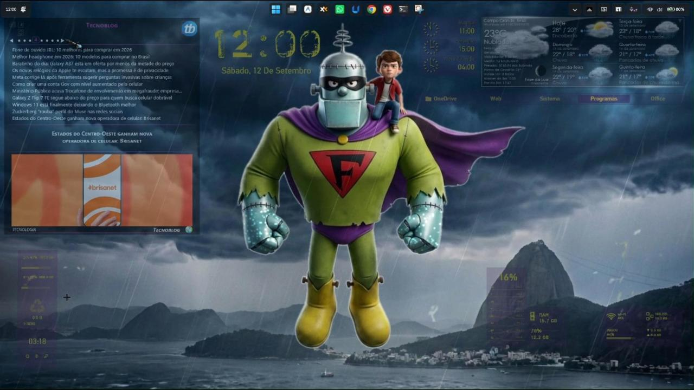

# ⚡ StormFeed v1.0.3

[](https://www.rainmeter.net/)
[](https://github.com/Geovanesou/StormFeed/releases)
[](LICENSE)
[](https://www.deviantart.com/geovanesou)

> **A powerful, resilient, and visually refined RSS & Atom news reader suite for Rainmeter.**  
> Featuring cyclical image galleries, unified single-instance tooltips, robust CDATA parsing, and persistent layout management.

[](https://github.com/Geovanesou/StormFeed)
*StormFeed — Evolving desktop RSS feeds into a high-performance storm of news and visual media.*

---

## 📖 Overview

**StormFeed** is an evolved, modernized fork of **Rain Feeder RSS 1.01 Beta** (originally crafted by **NatashaJay** on DeviantArt). While the original concept introduced an inspired visual fusion between news headlines and cyclical image previews, it was hindered by several architectural limitations, channel refresh bugs, and encoding quirks.

StormFeed takes that vision to the next level—upgrading a gentle "rain" into a robust, high-performance "storm" of news and visual media on your desktop.

---

## 🚀 Key Improvements in v1.0.3

- **Unified Storm Brand Identity & Header Ergonomics:** Added stylized `⚡ StormFeed` DirectWrite typography in the header, unified with the visual language of the StormTicker suite.
- **Symmetric Controls Alignment:** Realigned the Options Menu (`[MtMenuOn]`), Window Layout mode (`[MtWinButton1]`), and Refresh (`[MtRefresh]`) into a clean, horizontal toolbar.
- **Interactive Portal Navigation:** Clicking the channel favicon badge now directly opens the official website of the active news portal in your default browser with responsive hover feedback and tooltip cues.
- **Streamlined Architecture:** Deactivated legacy, overlapping drawer elements underneath the site badge to ensure predictable, ghost-free mouse interaction.
- **Storm Ecosystem Synergy:** Integrated discreet cross-promotion for the new **StormTicker Pro** asynchronous live news ticker suite into the header brand hover and Rainmeter's native context menu.

---

## 🚀 Key Improvements in v1.0.2

- **Unified Single-Instance Tooltip Architecture:** Replaced all 22 native Win32 `ToolTipText` declarations with a singular dynamic meter container (`[TipContainer]` + `[TipText]`). Completely eliminates multi-tooltip queuing, stacking ghost artifacts, and Win32 flicker on rapid mouse sweeps.
- **Brand Identity & High-Performance Fallback Assets:** Integrated the official Rio tempest RSS artwork across all channels (`nofeed.png` and feeds 2–8), calibrated with adaptive palette quantization (~378 KB) for zero I/O latency.
- **Cold-Start Resilience for Large 2x3 (Layout 3):** Explicitly calculates `CalcWidth` and `WindowFeedwidth` upon cold start, and forces unhiding and updating of `Top10Items` and `Next10Items` groups so headlines render immediately without toggling.
- **Dynamic Variable State Persistence:** Switched layout persistence actions (`MtWinButton1` and feed selectors) to dynamic evaluation syntax `"[#WindowType]"`, resolving the 1-click write-lag issue where the previous layout was saved instead of the new one.
- **Config Single Source of Truth:** Removed redundant and conflicting `WindowType` definition from `UserVariables.inc`, establishing `StormFeed.ini` as the authoritative source and setting active default layout to WindowType 4.
- **Dynamic Variable Meter Inheritance:** Added explicit `DynamicVariables=1` and dual group membership (`Top10Items | Feeds`, `Next10Items | Feeds`) to items 1–22, overcoming Rainmeter's lack of `DynamicVariables` inheritance via `MeterStyle`.

---

## 🌟 Evolved from Rain Feeder RSS

| Feature / Issue | Rain Feeder 1.01 Beta | StormFeed |
| :--- | :--- | :--- |
| **Active Layout Persistence** | Reverted to Layout 0 whenever a channel button was clicked or skin was refreshed. | **100% Persistent.** Stays on your chosen layout (e.g. Layout 4) across channel switches and restarts. |
| **Text Geometry (`WindowFeedwidth`)** | Loading Layout 4 directly applied an uninitialized variable, collapsing text width to 0 (invisible headlines). | **Self-contained & resilient.** Text boxes dynamically lock to full width (~480px) on every boot. |
| **Headline Tooltips** | Long headlines were cut off with an ellipsis with no way to read the full text on hover. | **Native hover tooltips** on all 22 items showing full unclipped headlines and source info. |
| **URL Sanitization (The `.br` Bug)** | Naive regex intended for `<br>` stripped `br` inside URLs (e.g. `canaltech.com.br` &rarr; `canaltech.com..`), breaking 404 links and image CDNs. | **Surgical parsing.** Country-code TLDs (`.br`, `.fr`, etc.) and image CDN endpoints are 100% preserved. |
| **CDATA & Media Enclosures** | Failed or broke on complex HTML-encoded feeds and Google News redirects. | **Modernized Lua regex engine** supporting CDATA, Google News redirects, and image enclosures. |
| **Default Configuration** | Shipped with Layout 0 (text-only, no images). | **Ships configured on Layout 4** (sleek horizontal feed + cyclical bottom image showcase). |

---

## 🪟 Layout Modes

StormFeed includes **7 built-in layout modes**, toggled seamlessly by clicking the window icon in the header:

- **Layout 0:** Compact (10 items, text only, no image)
- **Layout 1:** Wide 1x2 (10 items left, small image feed right)
- **Layout 2:** Wide 1x3 (10 items left, wide image feed right)
- **Layout 3:** Large 2x3 (20 items, large image right)
- **Layout 4:** ⭐ **Default Recommended** (10 items top, cyclical high-res image showcase bottom)
- **Layout 5:** Tall 2x1 (20 items, text only)
- **Layout 6:** Showcase (22 items tall + wide cyclical image gallery bottom)

---

## 📦 Installation

### Method 1: Automated Package (`.rmskin`) — Recommended
1. Download the latest `StormFeed_1.0.3.rmskin` from the **[Releases](https://github.com/Geovanesou/StormFeed/releases)** page.
2. Double-click the file to open the Rainmeter Skin Installer.
3. Click **Install**. Rainmeter will automatically unpack and activate **StormFeed**.

### Method 2: Manual Installation (Git)
1. Clone the repository into your Rainmeter skins directory:
   ```bash
   git clone https://github.com/Geovanesou/StormFeed.git "%USERPROFILE%\Documents\Rainmeter\Skins\StormFeed"
   ```
2. Right-click the Rainmeter tray icon and select **Refresh all**.
3. In the Rainmeter Manage dialog, navigate to `StormFeed > StormFeed.ini` and click **Load**.

---

## ⚙️ Customizing Your Feeds

You can configure up to 34 RSS/Atom feeds by editing `StormFeed.ini`:

1. Right-click the skin and select **Edit skin**.
2. Scroll to the `[URL and FEED Data]` section.
3. Update `URL#`, `CustomTitle#`, and `storysect#` for your preferred news sources.
4. Save the file and right-click &rarr; **Refresh skin**.

---

## 👥 Credits & Acknowledgements

StormFeed stands on the shoulders of giants in the Rainmeter customization community:

- **NatashaJay** ([DeviantArt](https://www.deviantart.com/natashajay)) — Original *Rain Feeder RSS 1.01 Beta* design, styling, and core concepts.
- **Kaelri** ([Rainmeter Forums](https://forum.rainmeter.net/)) — Core *FeedReader* Lua script and *Universal Transition* engine.
- **Eclectic-Tech** ([DeviantArt](https://www.deviantart.com/eclectic-tech)) — Visual inspiration from *Win10 RSS* and *RSSFeedPackMax*.
- **HiTBiT-PA** ([DeviantArt](https://www.deviantart.com/hitbit-pa)) — Design paradigms from *MEGA READER*.
- **Brian Ferguson** ([Rainmeter Forums](https://forum.rainmeter.net/)) — *SystemColor* plugin.
- **Yincognito** ([Rainmeter Forums](https://forum.rainmeter.net/)) — Custom tooltip mechanics.
- **Geovane Souza** ([@Geovanesou](https://github.com/Geovanesou)) — Architecture modernization, layout persistence engine, geometry bug fixes, tooltip integration, and ongoing maintenance.

---

## 📄 License

Distributed under the **Creative Commons Attribution-NonCommercial-ShareAlike 3.0 Unported ([CC BY-NC-SA 3.0](https://creativecommons.org/licenses/by-nc-sa/3.0/))** license, preserving all original attributions.
